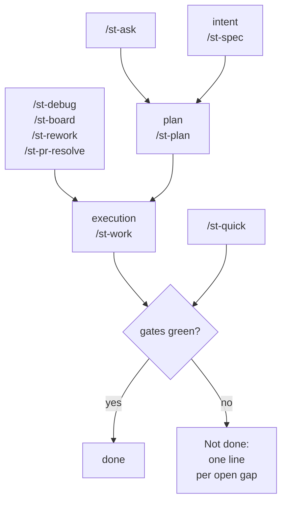

<!-- HAND-WRITTEN PAGE — verified against the tree at commit 4607a76. -->
<!-- Re-open when: a touchpoint joins or leaves, or its one-line job changes in content/charter/stamity-charter.md — the touchpoint index's owner;
     a `stamity worktree` subcommand joins or leaves; `.stamity/worktree.json` or the receipt `version` changes shape;
     or the site stops rendering the mermaid fence. `test/docsPages.test.ts` holds this page to the hand-page contract. -->

# Working with stamity

[Setup](getting-started.md) leaves a charter, a conditional rule and skill layer, and nine touchpoints covering the
lifecycle. This page is which one to open for a piece of work, what each may do, and what is on disk when it stops.

## The nine

| Touchpoint | Its job | Reach for it when |
|---|---|---|
| `/st-spec` | create or maintain the project spec under `docs/specs/`; greenfield and brownfield auto-detected | the change needs a written definition of done before anyone plans it |
| `/st-plan` | route an intent (feature, bug, refactor, migration, test, roadmap) into a persisted plan | research spans several angles, or a human reviews before code moves |
| `/st-work` | execute planned work end to end; closes with the QA human checkpoint | scope is settled and the work starts now |
| `/st-board` | work a task board: chat, a referenced file, or a linked platform board | the input is a backlog rather than one change |
| `/st-ask` | read-only codebase Q&A; writes nothing | you need to understand something before deciding anything |
| `/st-debug` | reproduce, root-cause, and fix a defect | behaviour is wrong and the cause is not yet known |
| `/st-quick` | Tier-1 small-change lane; gates still run | the change is small, obvious, and touches five files or fewer |
| `/st-rework` | apply structured feedback to agent-implemented work | delivered work came back with comments |
| `/st-pr-resolve` | resolve pull-request review comments | those comments live on a pull request |

Only a client with a project command surface turns these into `/st-<name>` invocations: Claude Code and Copilot do;
Cursor reads them as skills and Codex has no repository-level command home, so on those two you ask for the flow by
name in plain words. [The capability matrix](capability-matrix.md) is the one home for that, per client.

## The spine

`/st-spec` grounds the intent, `/st-plan` turns it into an artifact somebody can argue with, `/st-work` executes; the
other six are entry points onto it. `/st-ask`'s ladder names `/st-work`, `/st-debug` and `/st-quick` as well as the
plan, debug's root cause plus failing test stands in for it, and quick joins at the gate because it delegates them.

## Picking the entry point

The first row that fits wins.

| If … | open … |
|---|---|
| it is a question, not a change | `/st-ask` |
| feedback on delivered work, on a pull request | `/st-pr-resolve` |
| feedback on delivered work, anywhere else | `/st-rework` |
| a backlog, not one change | `/st-board` |
| behaviour is wrong with no known cause | `/st-debug` |
| the definition of done spans more than this one change | `/st-spec` |
| small, obvious, five files or fewer | `/st-quick` |
| a human reads the plan first | `/st-plan` |
| otherwise | `/st-work` |

**Quick refuses rather than stretches**: more than five files, roughly 200 changed lines across the batch, any
dependency or lockfile change, any public contract or migration, or any touch on authentication, authorization,
session handling, credentials, key material, payments or access control ends the lane for that item. The security row
has no size floor — a one-character edit under a credential path is refused, because that surface needs the review
loop quick does not run. The refusal states the measurement and carries the item list to `/st-work`.

**Debug instruments to observe, never to fix.** Its exit is a root cause with cited evidence plus a failing test,
which becomes the plan handed to `/st-work` — or to `/st-quick`, for one mechanical slip inside the thresholds above.
A command that fixes by default cannot gate the step that performs the fix. **Plan and work differ in what outlives
the session:** `/st-work` decomposes in-session and continues straight into Build, while `/st-plan` stops at a
persisted artifact under `docs/plans/` that survives the session, gets reviewed, and is picked up by a later
`/st-work` run or by `/st-board fill`.

## One change, walked through

The work: a rate limit on an existing endpoint — a feature, on a public contract, with no written "done".

1. **Orient.** `/st-ask` for what already exists — the middleware, the error shape, whether anything retries. It
   writes nothing, so it costs only the reading.
2. **Plan.** `/st-plan` persists one artifact under `docs/plans/`, decomposed into units executable without session
   history, carrying the acceptance criteria, a `stamp:` of the head commit and the `reads:` paths it read, so a later
   run judges freshness per path; `/st-work` merges the spec delta at Prove, so the change earns its spec entry on the
   way.
3. **Execute.** `/st-work` runs Frame, Understand, Plan, Build, Prove; Build dispatches to sub-agents, because the
   orchestrator does not edit product files (charter invariant 7).
4. **Prove.** Each pass spawns a dedicated `test-runner` returning the gates one by one with the exact command and
   verbatim failing excerpts — bare pass/fail is not a result — then a reviewer/fixer loop on `file:line` evidence,
   capped at four rounds by default, stopping as blocked with the open findings attached.
5. **Close.** The QA human checkpoint is mandatory at every intensity: a what-to-verify summary naming each observable
   behaviour the change added or altered, each with an under-a-minute check, then a guided pass.

On disk after: the proof block under `.stamity/runs/` — gate results with their commands, review verdicts per round,
the decisions trace, artifacts touched with their owning sub-agent, a recommended next step derived from that run's
state — beside it the findings ledger, one row per finding, under the run-exit invariant that none ends pending: each
closes fixed, deferred with a rationale, or rejected with reasoning. Spec deltas merge into `docs/specs/`,
confirm-gated and append/merge-only. By contrast a typo is one `/st-quick` item closing in one pass, and a bug with no
known cause starts at `/st-debug`, reaching the same pipeline one step later with a failing test.

## No green, no done

Every flow ends on the charter's verification gates — here `npm run lint && npm run typecheck && npm run test` — and
the floor holds at every tier, in every lane, including `/st-quick`. A run that cannot reach green ships a `Not done:`
list naming each open gap instead of a claim. That is why quick delegates its gates even though it applies its own
edits inline: "the gates ran" is worth reading only when it comes from somewhere other than the writer.

## Two changes at once

One tree per change, one branch each, one clone. `stamity worktree` creates the checkout, places machine-local files a
checkout cannot carry, records what it placed, and tears down from that record. Nothing lands in your working tree —
the record goes in that tree's git directory — so no ignore rule, and `git status` is unchanged.

- `stamity worktree setup <name>` — creates the tree under the farm, which defaults to `../.stamity-worktrees/<repo-name>/`, beside the clone rather than inside it; `<name>` is both the directory under the farm and the branch the worktree checks out. A setup that gets half way exits 1 and still reports the worktree's path and branch and each entry's own outcome; the recovery is `cleanup <name>`, or `cleanup <name> --force` when even the receipt failed to write and nothing can scope the tree. A run refused before anything was created reports no worktree, because there is none.
- `stamity worktree list` — one row per worktree git knows about, managed by this lane or not: path, branch, head, dirty counts, ahead/behind, whether a receipt is present, whether that tree carries a stamity setup, and how many handoff records it holds. Above the table, if the clone has stashed work, one line saying so — a stash is one list for the whole clone and belongs to no row below it.
- `stamity worktree cleanup <name>` — inverts the receipt and nothing else: it removes what setup recorded placing, a copy whose bytes you have edited since is kept and reported as diverged rather than deleted, and a worktree with no readable receipt is reported and left alone. Then the checkout goes — `--force` for one carrying uncommitted changes, `--files-only` to leave the checkout in place, `--all` to sweep every worktree this lane manages.

What travels with the checkout:

- `AGENTS.md`, the `.agents/` and `.claude/` trees, `.stamity/` with its manifest, learnings and handoffs — yes, because they are committed on purpose — the new worktree comes up with the same charter, rules, skills and touchpoints as the original. Records written but not committed do not travel; that is a property of a checkout, and `list` is what makes it visible rather than surprising.
- `.env.mcp` — no, so setup places it: `.gitignore` excludes it as MCP credentials, so setup copies it across and holds it at `0600` rather than leaving you to remember.
- `node_modules` — no, and setup leaves it alone — a built-in `skip`, because a symlinked dependency directory gets written *through* by the next install. Install inside the new tree.
- `.stamity/worktree.json` — it is the override for the two entries above: add an entry, mark one `secret`, or skip something. Absent, which it is in most repositories, those two defaults apply.

| Consent gate | Interactively | Under `--json` or with no TTY |
|---|---|---|
| a branch that already exists locally | you get the question | it refuses, naming `--use-existing` |
| a branch that exists on `origin` | you get the question | it refuses, naming `--track` |
| copying anything marked `secret` | you get the question | the copy is skipped, the report naming `--copy-secrets` |
| all three at once | `-y` answers them | `--dry-run` prints the resolved farm, the branch plan, the entry table and every gate's answer, and asks nothing |

**A branch is never deleted**, not by setup, not by cleanup, not under `--force`; the report prints the
`git branch -d <name>` line to run yourself, because a directory is reconstructible from a ref and a ref is not from a
directory. Plain `git worktree add` still works; such a tree appears in `list` as unmanaged and `cleanup` leaves it
alone. Run touchpoints and gates in each tree independently — a green gate in one says nothing about the other, and
the branches meet only at merge, where charter invariant 6 applies if they touch the same API shape, schema or event:
file-disjoint is not contract-disjoint.

## Where to go next

- [Getting started](getting-started.md) — install, what lands, and the first proven change.
- [CLI reference](cli-reference.md) — every verb, flag, and exit status.
- [Packs and trust](packs-and-trust.md) — adding content on top of the corpus, and the gates it passes.
- [Troubleshooting](troubleshooting.md) — what `check` prints, and what each row means.
