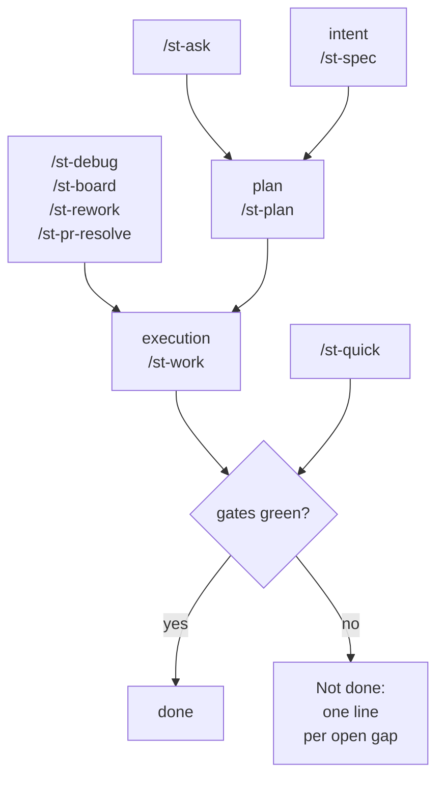

<!-- HAND-WRITTEN PAGE — verified against the tree at the 1.9.1 release cut (2026-09-23). -->
<!-- Re-open when: a touchpoint joins or leaves, or its one-line job changes in content/charter/stamity-charter.md — the touchpoint index owns that wording; a `stamity worktree` subcommand joins
     or leaves; `.stamity/worktree.json` or the receipt `version` changes shape; the heading above the mermaid fence is renamed without its CSS reservation in website/src/css/custom.css; or the
     site stops rendering that fence. `test/docsPages.test.ts` holds this page to the hand-page contract. -->

# Working with stamity

This page is for you once stamity is installed and you have real work to do. It answers three questions: which of the nine touchpoints to open, what
that one may do, and what is on disk when it stops. A touchpoint is one of the `/st-` slash commands your agent runs. Nine of them cover the SDLC,
and [setup](getting-started.md) leaves all nine in place.

## Which touchpoint does what

| Touchpoint | Its job |
|---|---|
| `/st-spec` | create or maintain the project spec under `docs/specs/`; greenfield and brownfield auto-detected |
| `/st-plan` | route an intent (feature, bug, refactor, migration, test, roadmap) into a persisted plan |
| `/st-work` | execute planned work end to end; closes with the QA human checkpoint |
| `/st-board` | work a task board: chat, a referenced file, or a linked platform board |
| `/st-ask` | read-only codebase Q&A; writes nothing |
| `/st-debug` | reproduce, root-cause, and fix a defect |
| `/st-quick` | Tier-1 small-change lane; gates still run |
| `/st-rework` | apply structured feedback to agent-implemented work |
| `/st-pr-resolve` | resolve pull-request review comments |

Only a client with a project command surface turns these into `/st-<name>` invocations. Claude Code, Copilot and Cursor do. Cursor ships them as
explicitly invoked skills under `.cursor/skills/`. Codex has no repository-level command home, so there you ask for the flow by name instead. [The
capability matrix](capability-matrix.md) is the one home for that, per client.

## How the nine fit together

Three touchpoints form the spine. `/st-spec` grounds the intent. `/st-plan` turns it into an artifact somebody can argue with. `/st-work` executes.
The other six are entry points onto that spine. `/st-ask` hands off to `/st-work`, `/st-debug`, `/st-quick` or `/st-plan`, whichever its ladder names.
`/st-debug` hands over a root cause plus a failing test, and that pair stands in for the plan. `/st-quick` joins at the gate, because it delegates its
verification.

## Picking the entry point

Read the table top to bottom. The first row that fits wins.

| If … | open … |
|---|---|
| it is a question, not a change | `/st-ask` |
| feedback on delivered work, on a pull request | `/st-pr-resolve` |
| feedback on delivered work, anywhere else | `/st-rework` |
| a backlog, not one change | `/st-board` |
| behaviour is wrong and nobody knows the cause | `/st-debug` |
| the definition of done is unwritten, and it spans more than this change | `/st-spec` |
| small, obvious, five files or fewer | `/st-quick` |
| research spans several angles, or a human reads the plan before code moves | `/st-plan` |
| otherwise | `/st-work` |

**`/st-quick` refuses rather than stretches.** Five thresholds end the lane for an item. More than five files. Roughly 200 changed lines across the
batch, counted as added plus removed. Any added dependency, version bump or lockfile change. Any API shape, database schema, event payload or
migration. Any touch on authentication, authorization, session or credential handling, key material, payments or access-control configuration. That
last row has no size floor: a one-character edit under a credential path is refused, because that surface needs the review loop quick does not run.
The refusal names the row that fired and the value it measured, and the item list carries over to `/st-work`. Handing you the diff to paste, or
splitting an item into pieces that each miss a threshold, is the same refused change with a different hand on the keyboard.

**`/st-debug` instruments to observe, never to fix.** Its exit is a root cause with cited evidence, plus a failing test. That pair becomes the plan
handed to `/st-work`, or to `/st-quick` for one mechanical slip inside the thresholds above. A touchpoint that fixes by default cannot gate the step
that performs the fix. **`/st-plan` and `/st-work` differ in what outlives the session.** `/st-work` decomposes the work in-session and continues straight
into Build. `/st-plan` stops at a persisted artifact under `docs/plans/`. That artifact survives the session, gets reviewed, and is picked up by a
later `/st-work` run or by `/st-board fill`.

## Walking one change through

Say the work is a rate limit on an existing endpoint. It is a feature. It lands on a public contract. Nothing yet says what done means.

1. **Orient.** `/st-ask` tells you what already exists: the middleware, the error shape, whether anything retries. It writes nothing, so it costs you
   only the reading.
2. **Plan.** `/st-plan` persists one artifact under `docs/plans/`. It decomposes the work into units executable without session history, each carrying
   its acceptance criteria. Two head keys record freshness: `stamp:` is the head commit, and `reads:` is the paths the plan read. A later run judges
   staleness per path, so a one-file drift does not invalidate the rest.
3. **Execute.** `/st-work` runs Frame, Understand, Plan, Build and Prove. Build dispatches to sub-agents. Charter invariant 7 keeps the orchestrator
   out of product files itself.
4. **Prove.** Each pass spawns a dedicated `test-runner`. It returns the verification gates one by one, with the exact command and any verbatim
   failing excerpt. Bare pass or fail is not a result. Then a reviewer and fixer loop on `file:line` evidence, capped at four rounds by default. A
   loop that runs out stops as blocked, with the open findings attached.
5. **Close.** The QA human checkpoint is mandatory at every intensity. You get a what-to-verify summary naming each observable behaviour the change
   added or altered, each with a check you can run in under a minute. Then a guided pass.

On disk when the run stops: a proof block under `.stamity/runs/`. It carries gate results with their commands, review verdicts per round, the
decisions trace, artifacts touched with their owning sub-agent, and a next step derived from that run's own state. Beside it sits the findings ledger,
one row per finding. No finding ends the run pending: each closes fixed, deferred with a rationale, or rejected with reasoning. Spec deltas merge into
`docs/specs/` at Prove, confirm-gated and append/merge-only, so the change earns its spec entry on the way. A typo instead is one `/st-quick` item
closing in a single pass. A bug with no known cause starts at `/st-debug` and reaches the same pipeline one step later, carrying a failing test.

## Which flows run the gates

Every flow that changes product code ends on the charter's verification gates. Here that is `npm run lint && npm run typecheck && npm run test`.
`/st-work` and `/st-quick` run them. `/st-debug`, `/st-rework` and `/st-pr-resolve` reach them through `/st-work` or a `test-runner` spawn.
`/st-quick` delegates its gates even though it applies its own edits inline. This holds at every tier and in every lane that edits code. `/st-spec`,
`/st-plan` and `/st-board` write records rather than product files, so they end on that artifact or on a handoff into `/st-work`. A run that cannot
reach green ships a `Not done:` list naming each open gap.

## Running two changes at once

`stamity worktree` gives you one tree per change, one branch each, out of one clone. It creates the checkout, places the machine-local files a
checkout cannot carry, records what it placed, and tears down from that record. Nothing lands in your working tree, because the record goes in the
new tree's git directory. So there is no ignore rule to add, and `git status` is unchanged.

- `stamity worktree setup <name>` creates the tree under the farm. The farm defaults to `../.stamity-worktrees/<repo-name>/`, beside the clone rather than inside it. `<name>` is both the directory under the farm and the branch the worktree checks out. A setup that gets half way exits 1. It still reports the worktree's path, its branch, and each entry's own outcome. The recovery is `cleanup <name>`, or `cleanup <name> --force` when even the receipt failed to write and nothing can scope the tree. A run refused before anything was created reports no worktree, because there is none.
- `stamity worktree list` prints one row per worktree git knows about, managed by this lane or not. Each row carries the path, the branch and the head. It adds the dirty counts, and how far ahead of or behind its upstream the branch is. It then says whether a receipt is present, whether that tree carries a stamity setup, and how many handoff records it holds. If the clone has stashed work, one line above the table says so. A stash is one list for the whole clone, so it belongs to no row below it.
- `stamity worktree cleanup <name>` inverts the receipt and nothing else. It removes what setup recorded placing. A copy whose bytes you have edited since is not inverted: it is reported as diverged and left where it is. A full cleanup then removes the directory around it, so `--files-only` is the invocation that actually preserves an edited copy. A worktree with no readable receipt is a consent gate of its own. Interactively you get the question. Under `--json` or with no TTY the run refuses, naming `--force`. Consent is `--force`, `-y`, or a yes at the prompt. With it the tree goes as a whole, because nothing can scope a file-by-file inversion there. Only `--files-only` leaves it standing, and it says why. Then the checkout goes: `--force`, `-y` or a yes for one carrying uncommitted changes, `--files-only` to leave the checkout in place, `--all` to sweep every worktree this lane manages.

What travels with the checkout:

- **Committed files travel.** `AGENTS.md`, the managed block in `CLAUDE.md`, the `.agents/` and `.claude/` trees, and `.stamity/` with its manifest, learnings and handoffs all come across. They are committed on purpose. The new worktree comes up with the same charter, rules, skills and touchpoints as the original. Records written but never committed do not travel. That is a property of a checkout, and `list` is what makes it visible rather than surprising.
- **`.env.mcp` does not, so setup places it.** `.gitignore` excludes it as MCP credentials. Setup copies it across and holds it at `0600`, rather than leaving you to remember.
- **`node_modules` does not, and setup leaves it alone.** It ships as a built-in `skip`, because a symlinked dependency directory gets written *through* by the next install. Install inside the new tree.
- **`.stamity/worktree.json` replaces both of those defaults wholesale.** It does not layer on them, so a file naming only a new entry drops the `.env.mcp` copy and the `node_modules` skip. Restate the rows you want kept, add an entry, mark one `secret`, or skip something. `.env.mcp` stays `secret` by identity whatever the file says. Most repositories have no such file, and then the two defaults apply.

| Consent gate | Interactively | Under `--json` or with no TTY |
|---|---|---|
| a branch that already exists locally | you get the question | it refuses, naming `--use-existing` |
| a branch that exists on `origin` | you get the question | it refuses, naming `--track` |
| copying anything marked `secret` | you get the question | the copy is skipped, the report naming `--copy-secrets` |
| all three at once | `-y` answers them | `--dry-run` prints the resolved farm, the branch plan, the entry table and every gate's answer, and asks nothing |

**A branch is never deleted.** Not by setup, not by cleanup, not under `--force`. The report prints the `git branch -d <name>` line for you to run
yourself, because a directory is reconstructible from a ref and a ref is not from a directory. Plain `git worktree add` still works. A tree outside
the farm shows in `list` as unmanaged, and `cleanup` leaves it alone. One inside the farm with no receipt goes only with consent, and then as a whole
tree. Run touchpoints and gates in each tree independently: a green gate in one says nothing about the other. The branches meet only at merge, where
charter invariant 6 applies if they touch the same API shape, schema or event. File-disjoint is not contract-disjoint.

## Where to go next

- [Getting started](getting-started.md) — install, what lands, and the first proven change.
- [CLI reference](cli-reference.md) — every verb, flag, and exit status.
- [Packs and trust](packs-and-trust.md) — adding content on top of the corpus, and the gates it passes.
- [Troubleshooting](troubleshooting.md) — what `check` prints, and what each row means.
